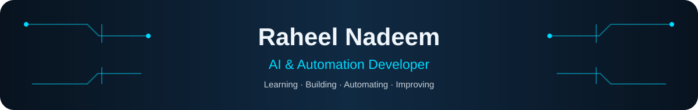
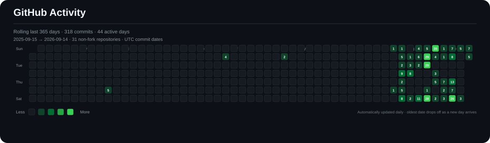
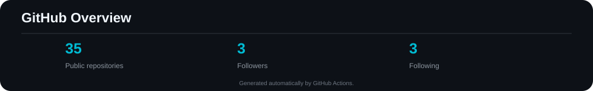

<div align="center">



<a href="https://github.com/raheel-9deem">
  
</a>

<br/>


</div>

<br/>

## 👋 About Me

I'm **Raheel Nadeem**, an **AI & Automation Developer** and BS Computer Science student focused on learning by building.

My current strongest areas are **WordPress, SEO, and n8n automation**, while **Python, Machine Learning, and NLP are active learning areas**. Most of the work you see here is self-initiated: I build projects to learn, experiment, solve problems, and document my progress.

- 🎓 **BS Computer Science — 4th Semester**, Lahore Leads University
- 🏫 **F.Sc Pre-Medical**, Govt. Graduate College Township, Lahore
- 🌐 Strongest current skills: **WordPress, SEO, n8n**
- 🐍 Currently learning: **Python, Machine Learning, NLP**
- 🤖 Building with **AI-assisted development** as part of my learning workflow
- 🧪 Projects are primarily **personal / self-initiated / open-source**
- 💼 **No client work yet** — currently exploring opportunities to turn my skills into real-world work
- 💰 **No project earnings yet** — the current goal is to learn, build, and pursue available opportunities
- 🚀 Long term: build products or a business of my own when the right opportunity and resources align

> **Build → Learn → Experiment → Improve → Earn → Build Something Bigger 🚀**

---

## 🧭 Learning Journey

```text
F.Sc Pre-Medical
        ↓
BS Computer Science
        ↓
WordPress + SEO
        ↓
n8n + Workflow Automation
        ↓
Python — Learning
        ↓
Machine Learning + NLP — Learning
        ↓
AI / ML Projects & Experiments
        ↓
AI-Assisted Development
        ↓
Build → Learn → Experiment → Improve
```

This is a learning journey, not a claim of mastery. I prefer showing **what I have actually built, what I am learning now, and what I am improving next**.

---

## 🧠 What I'm Building With

### Languages

<div align="center">


</div>

### AI / Machine Learning

<div align="center">


</div>

**Machine Learning · NLP · Scikit-learn · APIs · AI-assisted development**

### Automation

<div align="center">


</div>

**n8n · Workflow Automation · APIs · Webhooks · Automation Pipelines**

### Web

<div align="center">


</div>

**WordPress · Web Development · HTML · CSS · JavaScript**

### SEO

<div align="center">


</div>

**Keyword Research · Search Intent · On-Page SEO · Technical SEO · Content Optimization · SEO Auditing · Internal Linking · Search Performance**

---

## 🤖 AI & Developer Tools

<div align="center">

<a href="https://git-scm.com"></a>
<a href="https://github.com"></a>


</div>

---

## ⭐ Featured Projects

<table>
<tr>
<td width="50%" valign="top">

### 🤖 AI Resume Shortlisting

AI-assisted resume screening project exploring automated candidate shortlisting and practical AI workflows.

**Focus:** AI · Python · NLP · Resume Processing

<a href="https://github.com/raheel-9deem/AI-Resume-Shortlisting_main">View Repository →</a>

</td>
<td width="50%" valign="top">

### 🩺 AI-based Disease Detection

Machine-learning experimentation around disease prediction/classification using notebook-based development.

**Focus:** ML · Python · Jupyter · Scikit-learn

<a href="https://github.com/raheel-9deem/Ai-Disease-Detection">View Repository →</a>

</td>
</tr>
<tr>
<td width="50%" valign="top">

### 🧮 Nebula Scientific Calculator

A scientific calculator project built as a practical software-development experiment.

**Focus:** Python · Application Development

<a href="https://github.com/raheel-9deem/Nebula-Scientific-Calculator">View Repository →</a>

</td>
<td width="50%" valign="top">

### 📊 Machine Learning Notebooks

A growing collection of ML experiments and notebooks documenting techniques, datasets, models, and learning progress.

**Focus:** Python · ML · Jupyter · Scikit-learn

<a href="https://github.com/raheel-9deem">Explore My Repositories →</a>

</td>
</tr>
</table>

---

## 🔎 More Work

| Area | Selected work |
|---|---|
| 🤖 AI / ML | AI Resume Shortlisting · AI Disease Detection · ML notebooks · CNN / regression experiments |
| ⚙️ Automation | n8n Blogger Pipeline · workflow/API automation experiments |
| 🔍 SEO | SEO Audit CLI · SEO automation and content-oriented experiments |
| 🧰 Developer Tools | Deadcode Finder · README Translator · practical Python utilities |
| 🌐 Web | WordPress and web-development experiments |
| 🧩 Learning | DSA Questions · programming exercises and experiments |
| 🛡️ Security / Networking | NetSentry and related experiments |

[Explore all repositories →](https://github.com/raheel-9deem?tab=repositories)

---

## 📜 Certifications & Learning

- 🏅 **WordPress — DigiSkills.pk**
- 🏅 **SEO — DigiSkills.pk**
- 🐍 **Python — Currently Learning**
- 🤖 **Machine Learning — Currently Learning**

> Certifications are listed only when earned; active learning areas are clearly marked separately.

---

## 📈 GitHub Coding Journey

**Rolling last 365 days · GitHub-style contribution calendar · exact daily commit counts · auto-refresh every 30 minutes**

<!--START_ACTIVITY-->

<!--END_ACTIVITY-->

The activity visualization is generated automatically by GitHub Actions from public repository commit history. It is designed to keep the profile honest and current instead of using a manually maintained contribution table.

---

## 📊 GitHub Overview



---

## 🌱 Currently Learning

- 🐍 Python
- 🤖 Machine Learning
- 🧠 NLP
- 🔌 AI / API integration
- ⚙️ Advanced n8n automation
- 🛠️ AI-assisted software development

---

## 🌐 Find Me Online

<div align="center">

<a href="https://raheelnadeem.online"></a>
&nbsp;&nbsp;
<a href="https://www.linkedin.com/in/raheel-nadeem/"></a>
&nbsp;&nbsp;
<a href="https://instagram.com/iraheel_nadeem"></a>
&nbsp;&nbsp;
<a href="mailto:raheelnadeem@duck.com"></a>
&nbsp;&nbsp;
<a href="https://github.com/raheel-9deem"></a>

</div>

<br/>

<div align="center">

**Learning in public. Building in public. Improving one project at a time. 🚀**

</div>


</div>
